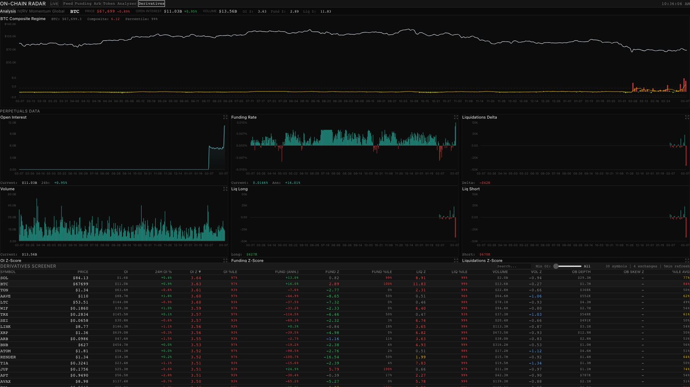
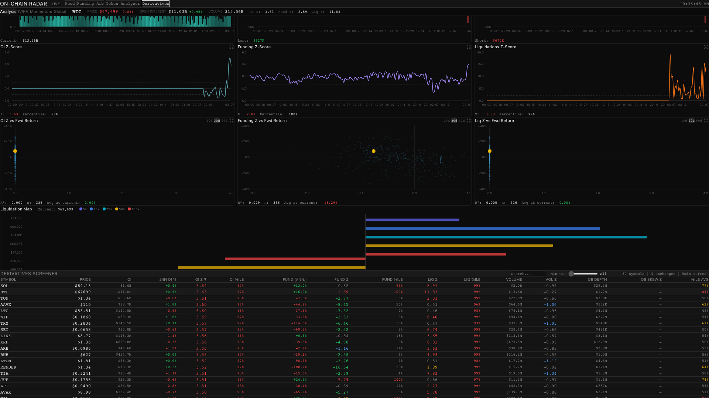
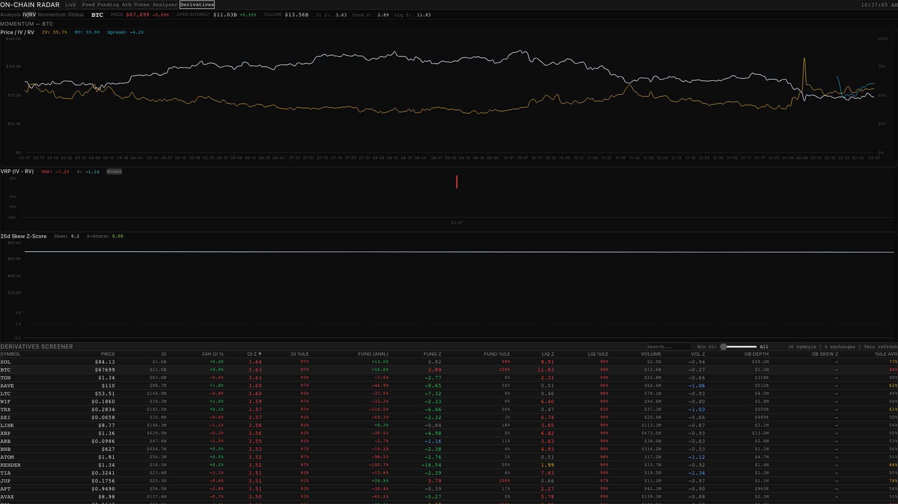
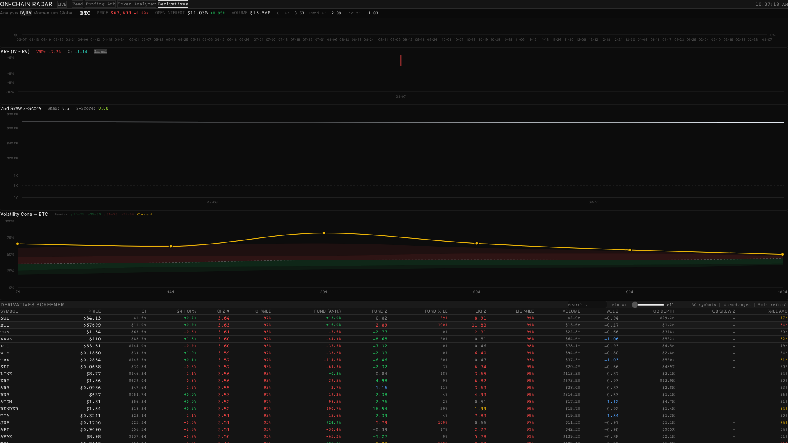
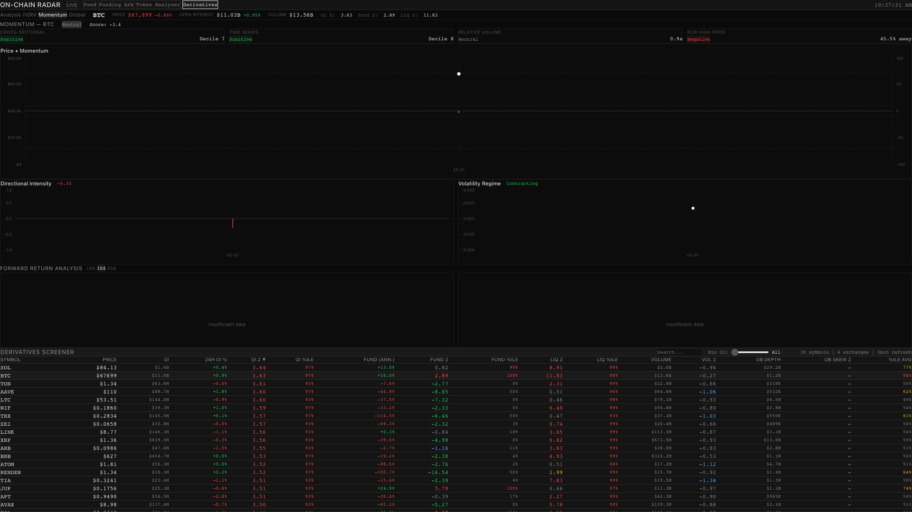
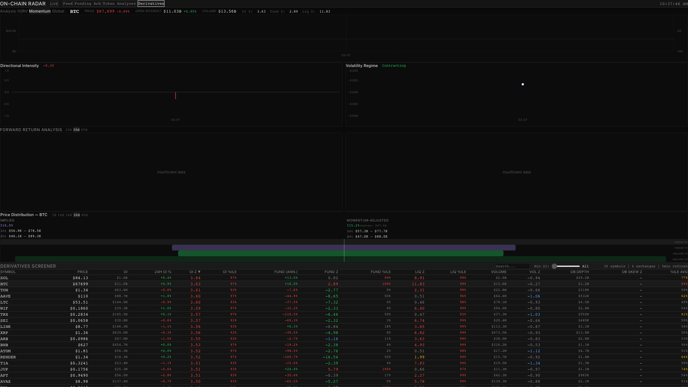
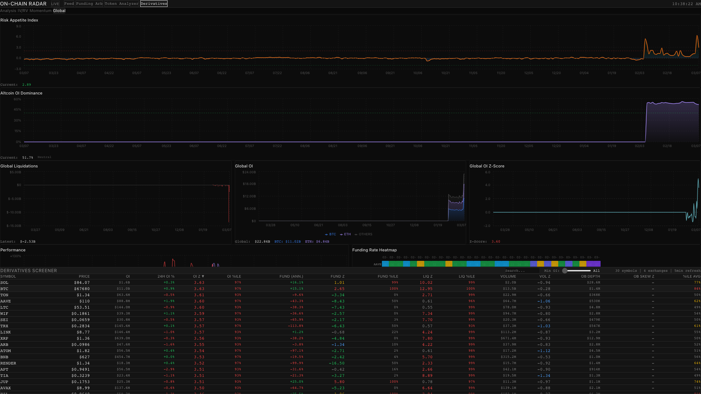
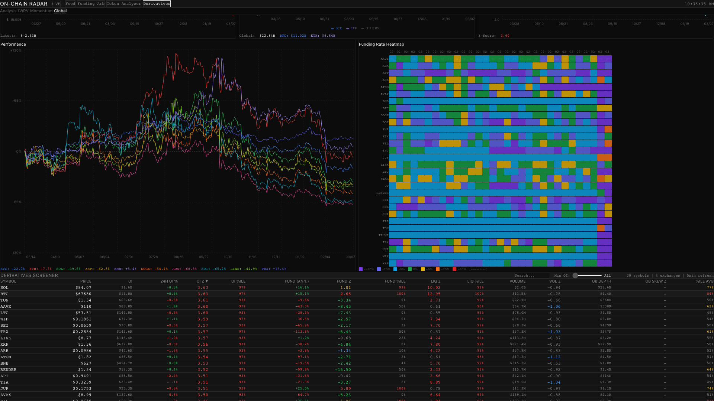
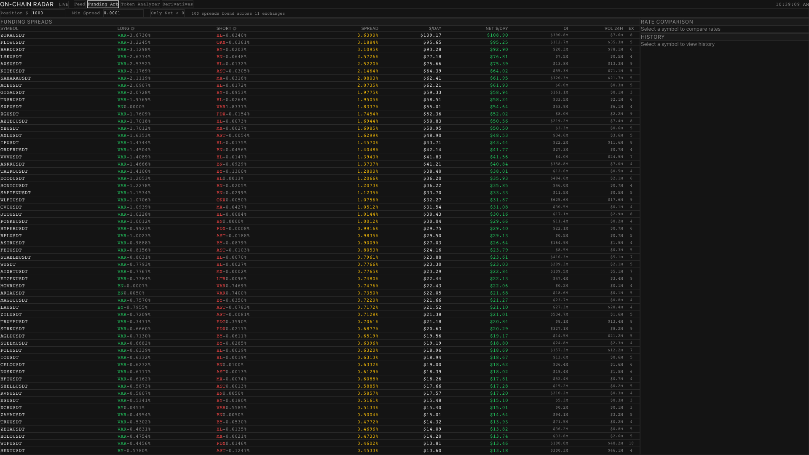
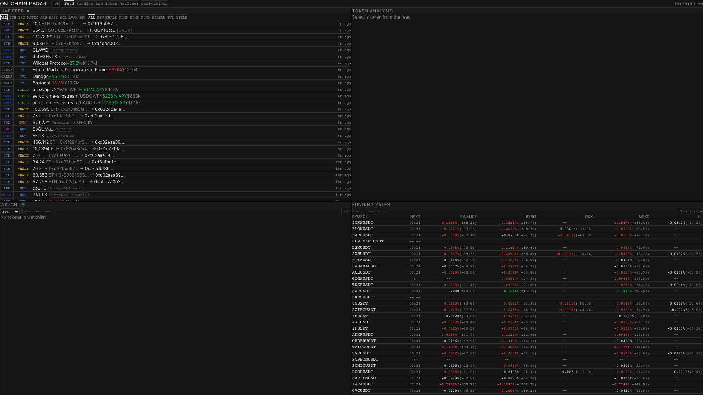

# Metrics Guide — On-Chain Radar

Полный гайд по метрикам деривативного дашборда. Каждая метрика: что показывает, как читать, торговая стратегия.

---

## Содержание

1. [Обзор дашборда](#1-обзор-дашборда)
2. [Screener](#2-screener)
3. [Open Interest](#3-open-interest)
4. [Funding Rate](#4-funding-rate)
5. [Liquidations](#5-liquidations)
6. [Volume](#6-volume)
7. [Composite Regime](#7-composite-regime)
8. [Z-Score Scatter Plots](#8-z-score-scatter-plots)
9. [Liquidation Map](#9-liquidation-map)
10. [IV/RV/Skew (вкладка IV/RV)](#10-ivrvskew-вкладка-ivrv)
11. [Variance Risk Premium (VRP)](#11-variance-risk-premium-vrp)
12. [Volatility Cone](#12-volatility-cone)
13. [Momentum Indicator (вкладка Momentum)](#13-momentum-indicator-вкладка-momentum)
14. [DI/VR vs Forward Return Scatter Plots](#14-divr-vs-forward-return-scatter-plots)
15. [Price Distribution](#15-price-distribution)
16. [Signal Gauges](#16-signal-gauges)
17. [Orderbook Depth & Skew](#17-orderbook-depth--skew)
18. [Global Dashboard](#18-global-dashboard)
19. [Altcoin OI Dominance](#19-altcoin-oi-dominance)
20. [Funding Arb](#20-funding-arb)
21. [Live Feed](#21-live-feed)
22. [Appendix A: Формулы](#appendix-a-формулы)
23. [Appendix B: Интервалы обновления](#appendix-b-интервалы-обновления)

---

## 1. Обзор дашборда

Дашборд мониторит 34 перп-символа на 4 биржах (Binance, Bybit, OKX, Bitget).

**Навигация верхнего уровня:**
- **Feed** — Live Feed событий (whale transfers, new pairs, TVL spikes, yield)
- **Funding Arb** — Арбитражные спреды между 11 биржами
- **Token Analyzer** — Анализ токенов (security score, Claude AI)
- **Derivatives** — Основной аналитический модуль

**Вкладки внутри Derivatives:**
- **Analysis** — Composite Regime + OI/Funding/Liq/Volume чарты + Z-Scores + Scatter + Liq Map
- **IV/RV** — Implied/Realized Volatility, VRP, Skew, Volatility Cone (BTC/ETH)
- **Momentum** — Multi-component momentum score, DI/VR, scatter plots, price distribution
- **Global** — Risk Appetite, Alt OI Dominance, Global OI, Heatmap, Performance


*Derivatives → Analysis: Composite Regime + Perpetuals Data (OI, Funding, Liquidations)*

---

## 2. Screener

### Что это
Таблица всех 30 символов с z-scores по 4 метрикам и средним перцентилем. Быстрый скан рынка для поиска аномалий.


*Screener внизу экрана: Symbol, Price, OI, 24H OI%, OI Z, OI %ile, Fund, Fund Z, Fund %ile, Liq Z, Liq %ile, Volume, Vol Z, OB Depth, OB Skew Z, %ile Avg*

### Колонки

| Колонка | Описание |
|---------|----------|
| Symbol | Тикер (BTCUSDT, ETHUSDT, ...) |
| Price | Текущая цена (Binance) |
| OI z | Z-score открытого интереса |
| Fund z | Z-score фандинга |
| Liq z | Z-score ликвидаций (абс. значение дельты) |
| Vol z | Z-score объёма |
| OB Skew Z | Z-score дисбаланса ордербука |
| %ile Avg | Среднее 4 перцентилей |
| OI Δ24h | Изменение OI за 24ч (%) |

### Цветовая кодировка z-scores

```
z ≥ +2   → красный    (экстремум вверх)
z ≥ +1   → жёлтый     (повышенный)
z ≤ -1   → синий      (пониженный)
z ≤ -2   → зелёный    (экстремум вниз)
иначе    → серый      (норма)
```

### Как читать
- **%ile Avg ≥ 80** — символ в экстремальном состоянии по нескольким метрикам
- **%ile Avg ≥ 60** — повышенная активность, потенциальный кандидат
- Сортировка по `abs(z)` — выносит наверх самые аномальные значения

### Стратегия: Выбор кандидатов

```
Шаг 1: Отсортировать по %ile Avg (desc)
Шаг 2: Выбрать символы с %ile Avg ≥ 60
Шаг 3: Проверить дивергенции:

  ┌─────────────────────────────────────────────────┐
  │  OI_z высокий + Fund_z низкий = накопление      │
  │  OI_z высокий + Fund_z высокий = перегрев       │
  │  OI_z падает  + Price растёт = дивергенция (!)  │
  │  Vol_z > 2    + любой другой z > 1 = breakout   │
  └─────────────────────────────────────────────────┘

Шаг 4: Кликнуть символ → перейти в Detail
```

---

## 3. Open Interest

### Что это
Суммарный открытый интерес в USD по 4 биржам. Растущий OI = новые позиции открываются, падающий = позиции закрываются.

### Агрегация

```
total_oi = binance_oi_usd
         + bybit_oi_coins  × binance_price
         + okx_oi_coins    × binance_price
         + bitget_oi_usd
```

### Как читать

```
         OI ($M)
    200 ┤
        │         ╭──╮
    180 ┤    ╭───╯   │     ← OI растёт: новые позиции
        │   ╭╯        │
    160 ┤──╯          ╰──── ← OI падает: ликвидации / закрытие
        │
    140 ┤
        └──────────────────── время

  Z-Score:
   +2 ┤ · · · · · · · · · ·  ← экстремум: перегрев рынка
   +1 ┤ - - - - - - - - - -
    0 ┤────────────────────── ← среднее (365 дней)
   -1 ┤ - - - - - - - - - -
   -2 ┤ · · · · · · · · · ·  ← экстремум: вымытые позиции
```

### Стратегия: OI/Price дивергенция

```
Сценарий 1: Цена ↑ + OI ↑ = подтверждённый тренд
  → Тренд здоровый, удерживать позицию

Сценарий 2: Цена ↑ + OI ↓ = дивергенция (разворот)
  → Рост на закрытии шортов, топ близко
  → Искать шорт при касании наклонной сверху

Сценарий 3: Цена ↓ + OI ↑ = накопление шортов
  → Агрессивные шорты, потенциальный шорт-сквиз
  → Готовиться к лонгу на сквиз-уровнях

Сценарий 4: OI_z > +2 = перегрев
  → Каскадные ликвидации вероятны
  → Не открывать новые позиции, ждать разгрузку
```

### Привязка к волновой теории

```
  Волна 1: OI начинает расти с низов (z < -1)
  Волна 3: OI резко ускоряется (z переходит в +1..+2)
  Волна 5: OI на максимуме (z > +2), дивергенция с ценой
  Коррекция A: OI резко падает, каскад ликвидаций
```

---

## 4. Funding Rate

### Что это
Периодическая выплата между лонгами и шортами для удержания перп-цены у спота. Положительный фандинг = лонги платят шортам (рынок перекуплен). Отрицательный = шорты платят лонгам.

### Settlement cycles

| Биржа | Период | Нормализация |
|-------|--------|-------------|
| Binance, Bybit, OKX, MEXC | 8ч | raw |
| Hyperliquid, Lighter | 1ч | × 8 |

**Annualized:** `rate × 3 × 365 × 100%`

### Как читать

```
  Funding Rate (8h)
  +0.05% ┤                 ╭─╮
         │              ╭──╯ │    ← лонги платят: рынок перегрет
  +0.01% ┤─ ─ ─ ─ ─ ─╱─ ─ ─ ─ ─  ← нейтраль
       0 ┤───────────/────────╰──
  -0.01% ┤─ ─ ─ ─ ╱─ ─ ─ ─ ─ ─
         │       ╭╯              ← шорты платят: рынок перепродан
  -0.05% ┤──────╯
         └──────────────────────── время
```

### Стратегия: Mean Reversion на экстремумах

```
  Funding Z-Score
  +2 ┤ · · · · · · · ╭─╮· ·  ← ШОРТ ЗОНА: funding_z > +2
     │              ╱   ╰╮
  +1 ┤ - - - - - -╱- - - ╰─
   0 ┤────────────────────────
  -1 ┤ - - - - - - - - - - -
  -2 ┤ · · · · · · · · · · ·  ← ЛОНГ ЗОНА: funding_z < -2
     └────────────────────────

  Правила:
  1. Funding_z > +2 → ищем шорт
  2. Funding_z < -2 → ищем лонг
  3. Подтверждение: совпадение с наклонной/зоной интереса
  4. Фильтр: не торговать в изоляции — только с контекстом
```

---

## 5. Liquidations

### Что это
Реал-тайм ликвидации с Binance и Bybit через WebSocket. Delta = long_liq - short_liq. Каскады ликвидаций создают точки разворота.

### WebSocket источники

| Биржа | Endpoint | Side mapping |
|-------|---------|-------------|
| Binance | `!forceOrder@arr` | SELL = long liquidated |
| Bybit | `allLiquidation` | Sell = long liquidated |

**Batch flush:** 3 события ИЛИ 10 секунд.

### Как читать

```
  Liq Delta ($M)
  +5 ┤          │         ← массовые ликвидации лонгов
     │          │            (давление продаж)
   0 ┤──────────┼──────────
     │     │    │    │
  -5 ┤     │         │    ← массовые ликвидации шортов
     └──────────────────── время
```

### Стратегия: Каскады как точки разворота

```
  1. liq_z > +2 + delta резкий всплеск → каскад
  2. После каскада: вся слабость выжжена
  3. Ищем лонг ПОСЛЕ каскада (не во время)
  4. Подтверждение: OI упал (z < -1), funding стал отрицательным
```

---

## 6. Volume

### Что это
Торговый объём в USD (Binance). Z-score показывает аномалии.

### Стратегия: Volume Confirmation

```
  ┌────────────────────────────────────────────────┐
  │  vol_z > +2 + пробой уровня = настоящий breakout│
  │  vol_z > +2 + нет пробоя    = кульминация       │
  │  vol_z < 0  + тренд         = затухание тренда  │
  │  vol_z < -1 + боковик       = накопление/распр.  │
  └────────────────────────────────────────────────┘
```

**Важно:** Volume z-score НЕ входит в composite regime.

---

## 7. Composite Regime

### Что это
Среднее трёх z-scores: OI + Funding + Liquidations + SMA-5 smoothing. Показывает "температурный режим" рынка.

### Формула

```
composite_z     = (oi_zscore + funding_zscore + liq_zscore) / 3
composite_sma5  = SMA(composite_z, 5)   ← жёлтая линия на графике
```


*Composite Regime: верх — Price chart (белая линия), низ — Composite Z bars (цветные) + SMA-5 overlay (жёлтая)*

### 6 режимов (цветовая шкала)

```
     ≤ -2   │ ██ Deep Oversold  │ зелёный
  -2 .. -1  │ ██ Oversold       │ бирюзовый
  -1 ..  0  │ ██ Neutral Cool   │ лайм
   0 .. +1  │ ██ Neutral Hot    │ жёлтый
  +1 .. +2  │ ██ Overbought     │ оранжевый
     > +2   │ ██ Extreme        │ красный
```

### Стратегия: Regime Transitions

```
  Переход из красного в оранжевый:
  → Рынок начинает остывать → ищем шорт

  Переход из зелёного в бирюзовый:
  → Рынок начинает восстанавливаться → ищем лонг

  Фильтр: НЕ торговать переходы внутри нейтральной зоны.
  Только экстремумы (green/red) дают высоковероятные сетапы.
```

---

## 8. Z-Score Scatter Plots

### Что это
Scatter plot: X = z-score метрики в момент T, Y = forward return через N дней. Показывает предсказательную силу z-score для будущего движения цены.


*OI Z vs Fwd Return, Funding Z vs Fwd Return, Liq Z vs Fwd Return — с R², n, Avg at current*

### Периоды
Переключатели: **10d**, **30d** (default), **60d**.

### Статистика

```
  R² = коэффициент детерминации (0..1)
  n  = количество исторических точек
  Avg at current = средний return при текущем z

  ● = историческая точка (серая)
  ★ = текущая позиция (жёлтая)
```

### Стратегия: Вероятностный edge

```
  ┌─────────────────────────────────────────────┐
  │  R² > 0.15 → есть статистическая связь      │
  │  R² > 0.30 → сильная связь, можно торговать │
  │  R² < 0.10 → z-score не предсказывает return │
  └─────────────────────────────────────────────┘

  Если текущий z < -2 и Avg at current > +10%:
  → Лонг на зоне интереса

  Если текущий z > +2 и Avg at current < -10%:
  → Шорт на наклонной сверху
```

---

## 9. Liquidation Map

### Что это
Карта теоретических уровней ликвидации на основе текущей цены и распределения плеч.


*Liquidation Map: горизонтальные бары — теоретические ликвидационные уровни на разных плечах (5x, 10x, 25x, 50x, 100x)*

### Leverage Tiers

| Плечо | Вес (% от OI) | Liq Long | Liq Short |
|-------|--------------|----------|-----------|
| 5×  | 10% | price × 0.80 | price × 1.20 |
| 10× | 25% | price × 0.90 | price × 1.10 |
| 25× | 30% | price × 0.96 | price × 1.04 |
| 50× | 20% | price × 0.98 | price × 1.02 |
| 100×| 15% | price × 0.99 | price × 1.01 |

### Стратегия: Ликвидационные магниты

```
  Кластеры ликвидаций работают как магниты для цены.

  1. Определить ближайший крупный кластер
  2. Кластер сверху = магнит для роста (шорт-сквиз)
  3. Кластер снизу = магнит для падения (лонг-сквиз)
  4. После забора кластера — быстрый разворот

  Если ликвидационный кластер совпадает с наклонной:
  → Усиленный магнит
  → Высокая вероятность реакции на этом уровне
```

---

## 10. IV/RV/Skew (вкладка IV/RV)

### Что это
Опционные метрики для BTC и ETH (Deribit). IV = ожидаемая волатильность, RV = реализованная, Skew = перекос путов к коллам.

**Только BTC и ETH** — для остальных символов доступен только RV.


*IV/RV вкладка: Price/IV/RV chart (dual-axis), VRP bar chart, 25d Skew Z-Score*

### Формулы

**IV:** Deribit DVOL Index (30-day)

**RV:**
```
log_returns[i] = ln(price[i] / price[i-1])
window = last 30 log returns
rv_30d = √variance × √365 × 100     ← annualized %
```

**25-Delta Skew:**
```
skew_25d = IV(25δ put) - IV(25δ call)
```
Положительный skew = путы дороже коллов = страх падения.

### Как читать

```
  Volatility (%)
  80 ┤
     │          ╭─╮
  60 ┤    IV ──╯  ╰──    ← IV выше RV: рынок ожидает движение
     │   ╭──────────╮
  40 ┤──╯  RV ──────╰──  ← RV ниже IV: рынок спокойнее ожиданий
     │
  20 ┤
     └──────────────────── время

  Vol Premium = IV - RV
  Premium > 0: опционы дорогие (продавать vol)
  Premium < 0: опционы дешёвые (покупать vol)
```

### Стратегия: Vol Premium + Skew Extremes

```
  ┌──────────────────────────────────────────────┐
  │  IV >> RV + skew_z > +2 (путы дорогие)        │
  │  = Панический хедж → лонг на зоне интереса   │
  ├──────────────────────────────────────────────┤
  │  IV << RV + skew_z < -2 (коллы дорогие)       │
  │  = Эйфория → шорт на наклонной              │
  ├──────────────────────────────────────────────┤
  │  IV и RV оба низкие (< 30%)                  │
  │  = Сжатие волатильности → breakout ahead     │
  └──────────────────────────────────────────────┘
```

---

## 11. Variance Risk Premium (VRP)

### Что это
Разница между IV и RV. Положительный VRP = опционы переоценены, отрицательный = недооценены.

### Формула

```
VRP   = IV_30d - RV_30d
VRP_z = z-score(VRP, window=365)
```


*VRP (IV-RV) bar chart с Rich Vol / Cheap Vol badge, ниже — 25d Skew Z-Score и Volatility Cone*

### Как читать

```
  VRP (%)
  +20 ┤
      │       ╭──╮
  +10 ┤  ╭───╯  ╰───   ← VRP высокий: опционы дорогие
   0  ┤╯─────────────── ← нейтраль
  -10 ┤─────────╯ ╰──  ← VRP отрицательный: опционы дешёвые
  -20 ┤
      └──────────────── время

  VRP Z-Score:
  z > +2  → "Rich Vol" badge (зелёный) — продавать vol
  z < -2  → "Cheap Vol" badge (красный) — покупать vol
```

### Стратегия: VRP Mean Reversion

```
  ┌──────────────────────────────────────────────────┐
  │  VRP_z > +2 ("Rich Vol"):                        │
  │  → Sell vol: продавать стрэддлы/стрэнглы         │
  │  → Или: VRP_z > +2 + skew_z > +2 = паника       │
  │    → лонг на зоне интереса                       │
  ├──────────────────────────────────────────────────┤
  │  VRP_z < -2 ("Cheap Vol"):                       │
  │  → Buy vol: покупать стрэддлы перед движением    │
  │  → Готовиться к breakout (vol expansion)         │
  └──────────────────────────────────────────────────┘
```

---

## 12. Volatility Cone

### Что это
Статистическое распределение RV на разных временных горизонтах (7d, 14d, 30d, 60d, 90d, 180d). Percentile bands показывают где текущая RV находится относительно истории.


*Volatility Cone: stacked area bands (p10-p25, p25-p50, p50-p75, p75-p90) + current RV points (жёлтые) + p50 median line (пунктир)*

### Bands

```
  RV (annualized %)
  100 ┤
      │  ╭───── 90th percentile
   80 ┤ ╱    ╭── 75th
      │╱   ╱
   60 ┤  ╱   ╭── 50th (median, пунктир)
      │ ╱  ╱
   40 ┤╱ ╱   ╭── 25th
      │ ╱  ╱
   20 ┤╱ ╱   ╭── 10th percentile
      │╱ ╱  ╱
    0 ┤─┴──┴──┴──┴──┴──┴──
      7d  14d 30d 60d 90d 180d

  ★ = текущая RV на каждом горизонте (жёлтые точки)
```

### Стратегия

```
  ┌────────────────────────────────────────────────┐
  │  Current RV < 10th pctl на всех горизонтах:    │
  │  → Vol compression extreme                     │
  │  → Breakout imminent → buy vol                 │
  ├────────────────────────────────────────────────┤
  │  Current RV > 90th pctl на коротких горизонтах: │
  │  → Vol spike → проверить liq_z                 │
  │  → После каскада vol вернётся к median          │
  └────────────────────────────────────────────────┘
```

---

## 13. Momentum Indicator (вкладка Momentum)

### Что это
Multi-component momentum score [-100, +100]. Определяет трендовые режимы, exhaustion, дивергенции с ценой.


*Momentum вкладка: header с regime badge + 4 metric cards + Price/Momentum dual-axis chart + DI/VR time series*

### Компоненты

```
  1. Cross-Sectional Decile
     Ранг 1-месячного return среди 30 peers
     Decile 10 = top-10% performers

  2. Time-Series Decile
     Ранг return относительно собственной истории
     Decile 10 = top-10% исторических returns

  3. Relative Volume Decile
     Volume vs историческая норма (BTC-relative для альтов)

  4. 52W High Proximity
     Расстояние до 52-недельного максимума
```

### Формула

```
score = decile_avg × 60 + DI × 30 + VR_signal × 10
clamped to [-100, +100]
```

### Regime Badges

```
  score > +70  → Overbought (синий)
  score > +10  → Bullish
  score > -10  → Neutral
  score > -70  → Bearish
  score ≤ -70  → Oversold (жёлтый)
```

### Metric Cards

4 карточки вверху Momentum page:
- **Cross-Sectional** — Decile + status (Positive/Negative)
- **Time Series** — Decile + status
- **Relative Volume** — множитель (e.g. 0.9x) + status
- **52W High Prox** — процент от high + status

### Price + Momentum Chart

Dual-axis chart: цена (белая линия, левая ось) + momentum score (гистограмма, правая ось). Показывает расхождения цены и momentum.

### DI / VR Time Series


*Directional Intensity (левый) и Volatility Regime (правый) — отдельные time series*

**Directional Intensity [-1, +1]:**
```
DI = (positive_days - negative_days) / total_days
+1 = все дни положительные
-1 = все дни отрицательные
```

**Volatility Regime:**
```
Expanding  = short-term vol > smoothed trend
Contracting = short-term vol < smoothed trend
```

### Стратегия

```
  ┌──────────────────────────────────────────────────┐
  │  Momentum > +70 (overbought):                    │
  │  = Exhaustion zone, не добавлять лонги            │
  │  → Ждать crossover вниз для шорта                │
  ├──────────────────────────────────────────────────┤
  │  Momentum < -70 (oversold):                      │
  │  = Capitulation zone                             │
  │  → Ждать crossover вверх для лонга               │
  ├──────────────────────────────────────────────────┤
  │  Все deciles ≥ 7 + momentum > +10:               │
  │  = Тренд подтверждён по всем осям                │
  │  → Momentum confirmation для existing setups      │
  └──────────────────────────────────────────────────┘
```

---

## 14. DI/VR vs Forward Return Scatter Plots

### Что это
Аналог Z-Score Scatter Plots, но для DI и Volatility Regime. X = DI (или VR) значение, Y = forward return через N дней.

### Периоды
Переключатели: **10d**, **30d**, **60d**.

### Как читать

```
  ● = историческая точка (серая)
  ★ = текущая позиция (жёлтая)
  ── = линия линейной регрессии

  Статистика: R², n, Avg at current
```

> **Примечание:** scatter plots заполняются по мере накопления данных (нужно 10+ дней momentum history). При старте системы отображается "insufficient data".

---

## 15. Price Distribution

### Что это
Ожидаемый диапазон цены на разных горизонтах. Две версии: Implied (на основе IV) и Momentum-Adjusted (с поправкой на тренд).


*Price Distribution: горизонтальные бары — 1σ (тёмные) и 2σ (светлые) диапазоны для Implied и Momentum-Adjusted*

**Только BTC и ETH** (требует IV из Deribit).

### Формулы

**Implied:**
```
upper_1σ = price × (1 + IV/100 × √(days/365))
lower_1σ = price × (1 - IV/100 × √(days/365))
```

**Momentum-Adjusted:**
```
drift       = momentum_score / 100 × 0.3
vol_adj     = VR > 0 ? 1.15 : 0.85
adjusted_IV = IV × vol_adj
upper_1σ    = price × (1 + drift + adjusted_IV/100 × √(days/365))
```

### Горизонты
Переключатели: **7d**, **10d**, **14d**, **30d**, **60d**.

### Как читать

```
  IMPLIED                    MOMENTUM-ADJUSTED
  $16.0k                     $15.2k ... $17.3k
  1σ: $56.9K — $78.5K       1σ: $57.3K — $77.7K
  2σ: $46.1K — $89.3K       2σ: $47.0K — $88.0K

  ├──────████████████──────┤  Implied 1σ
  ├────██████████████████──┤  Implied 2σ
  ├──────████████████──────┤  Adjusted 1σ
  ├────██████████████████──┤  Adjusted 2σ
```

---

## 16. Signal Gauges

### Что это
Горизонтальные gauge-индикаторы: Momentum Score и Volatility Skew.

### Momentum Gauge

```
  Oversold │ Bearish │ Neutral │ Bullish │ Overbought
  ─────────┼─────────┼─────────┼─────────┼──────────
  < -70    │ -70..-10│ -10..+10│ +10..+70│ > +70
           │         │    ▲    │         │
           │         │ current │         │
```

Показывает: score, z-score, avg, 30d change.

### Skew Gauge (BTC/ETH only)

```
  Bearish │ Neutral │ Bullish
  ────────┼─────────┼────────
  puts>>  │ balance │ calls>>
```

Показывает: skew value, z-score, avg, 30d change.

---

## 17. Orderbook Depth & Skew

### Что это
Глубина ордербука ±2% от mid-price (Binance Futures). Skew показывает дисбаланс bid/ask.

### Формулы

```
mid       = (best_bid + best_ask) / 2
bid_depth = Σ(p × q) where p ≥ mid × 0.98
ask_depth = Σ(p × q) where p ≤ mid × 1.02
ob_skew   = (bid - ask) / (bid + ask)
```

**Skew range:** [-1, +1]
- +1 = вся ликвидность на bid (поддержка)
- -1 = вся ликвидность на ask (давление продаж)

### Стратегия: Подтверждение наклонных

```
  ┌────────────────────────────────────────────────────┐
  │  Цена касается наклонной снизу + ob_skew > +0.3:   │
  │  → Ордербук подтверждает отбой → лонг              │
  ├────────────────────────────────────────────────────┤
  │  Цена касается наклонной сверху + ob_skew < -0.3:  │
  │  → Ордербук подтверждает отбой вниз → шорт         │
  ├────────────────────────────────────────────────────┤
  │  Пробой + skew разворот:                            │
  │  → Подтверждение breakout                          │
  └────────────────────────────────────────────────────┘
```

---

## 18. Global Dashboard

### Что это
Обзор всего рынка: Risk Appetite, Alt OI Dominance, Global OI, Liquidations, Performance, Funding Heatmap.


*Global: Risk Appetite Index, Altcoin OI Dominance, Global Liquidations, Global OI, OI Z-Score*


*Global: Performance chart (все 30 символов) + Funding Rate Heatmap (цветовая матрица)*

### Risk Appetite Index

```
risk_appetite = AVG((oi_z + funding_z + liq_z) / 3)
               по TOP-10 символам по OI
```

### Funding Rate Heatmap

Цветовая матрица: строки = символы, столбцы = даты. Цвет = funding rate:
- Фиолетовый → сильно отрицательный
- Бирюзовый → слабо отрицательный
- Зелёный → нейтральный
- Жёлтый/оранжевый → положительный

### Performance Chart

Линии всех 30 символов на одном графике. Показывает корреляцию и дивергенции.

### Стратегия: Risk-On/Risk-Off

```
  ┌────────────────────────────────────────────┐
  │  Risk Appetite > +1.5:                     │
  │  → Не открывать новые лонги                │
  │  → Искать шорт-сетапы                      │
  ├────────────────────────────────────────────┤
  │  Risk Appetite < -1.5:                     │
  │  → Наращивать экспозицию                   │
  │  → Искать лонг-сетапы                      │
  ├────────────────────────────────────────────┤
  │  Heatmap: >70% символов в одном цвете:     │
  │  → Торговать только BTC/ETH (ликвидность)  │
  └────────────────────────────────────────────┘
```

---

## 19. Altcoin OI Dominance

### Что это
Доля альткоинов в суммарном OI. Показывает куда течёт спекулятивный капитал.

### Формула

```
alt_dom = (total_oi - btc_oi) / total_oi × 100
```

### Как читать

На Global Dashboard — area chart с двумя reference lines:
- **40%** — risk-off порог (капитал в BTC)
- **65%** — risk-on порог (капитал в альтах)

Текущее значение + статус: **Risk-On** / **Neutral** / **Risk-Off**.

### Стратегия

```
  ┌────────────────────────────────────────────────┐
  │  Alt dominance > 65% + funding_z > +1.5:       │
  │  → Альты перегреты → сокращать экспозицию      │
  ├────────────────────────────────────────────────┤
  │  Alt dominance < 40% + OI global z < -1:       │
  │  → Альты вымыты → искать лонг в топ-альтах    │
  ├────────────────────────────────────────────────┤
  │  Быстрый рост alt dominance (>5% за неделю):   │
  │  → "Alt season" → агрессивно торговать альты   │
  └────────────────────────────────────────────────┘
```

---

## 20. Funding Arb

### Что это
Мониторинг funding rate спредов между 11 биржами для дельта-нейтрального арбитража.


*Funding Arb: таблица спредов (Long @ / Short @ / Spread / Net 8day / OI / Vol 24h), Rate Comparison + History*

### Как работает

```
  Биржа A:  +0.08% (платят лонги)
  Биржа B:  -0.02% (платят шорты)
  Спред:     0.10%
  ──────────────────────────────
  Действие:
  → Шорт на A (получаем +0.08%)
  → Лонг на B (получаем +0.02%)
  → Дельта-нейтральная позиция
  → Доход: 0.10% за 8ч = ~136% APR
```

### Фильтры

- **Min Spread** — минимальный спред для отображения
- **Only Net > 0** — только прибыльные спреды
- **Rate Comparison** — визуальное сравнение рейтов между биржами
- **History** — история фандинга для выбранного символа

---

## 21. Live Feed

### Что это
Реал-тайм поток событий с on-chain и DEX.


*Live Feed: события (WHALE, NEW, TVL, YIELD, PUMP, DUMP, SPREAD) + Token Analysis + Funding Rates + Watchlist*

### Типы событий

| Тип | Описание | Источник |
|-----|----------|----------|
| WHALE | Крупные переводы (>$50K) | Etherscan, Helius |
| NEW | Новые пары на DEX | DexScreener, GeckoTerminal |
| PUMP/DUMP | Резкие изменения цены | DexScreener |
| TVL | Спайки TVL протоколов | DefiLlama |
| YIELD | Высокие APY пулов | DexScreener |
| SPREAD | Funding спреды | 11 бирж |
| FUND | Экстремальный фандинг | Binance и др. |

### Фильтры
Кнопки по chain (ETH, BSC, SOL, ARB, BASE, ...) и по типу события.

---

## Appendix A: Формулы

### Z-Score (универсальная)

```
window = последние 365 значений
mean   = Σ(values) / n
std    = √(Σ(x - mean)² / n)     ← population std dev
z      = (current - mean) / std
pctl   = count(x < current) / n × 100

Минимум: n ≥ 7 (иначе z = 0, percentile = 50)
```

### Composite Regime

```
composite_z    = (oi_z + funding_z + liq_z) / 3
composite_sma5 = SMA(composite_z, window=5)
composite_pct  = (oi_pctl + funding_pctl + liq_pctl) / 3
```

### Momentum Score

```
decile_avg = (cross_sectional + time_series + relative) / 3
score      = decile_avg × 60 + DI × 30 + VR_signal × 10
clamped [-100, +100]
```

### Variance Risk Premium

```
VRP   = IV_30d - RV_30d
VRP_z = z-score(VRP, window=365)
```

### Altcoin OI Dominance

```
alt_dom = (total_oi - btc_oi) / total_oi × 100
```

### Directional Intensity

```
DI = (positive_days - negative_days) / total_days
Range: [-1, +1]
```

### OI Aggregation

```
total_oi = binance_oi_usd
         + bybit_oi_coins × price
         + okx_oi_coins × price
         + bitget_oi_usd
```

### Realized Volatility

```
log_ret[i] = ln(price[i] / price[i-1])
window     = last 30 log returns
rv_30d     = √(Var(window)) × √365 × 100%
```

### Orderbook Skew

```
mid       = (best_bid + best_ask) / 2
bid_depth = Σ(p × q) where p ≥ mid × 0.98
ask_depth = Σ(p × q) where p ≤ mid × 1.02
ob_skew   = (bid - ask) / (bid + ask)
```

### Liquidation Levels

```
liq_long  = price × (1 - 1/leverage)
liq_short = price × (1 + 1/leverage)
```

### Funding Annualized

```
APR = rate_8h × 3 × 365 × 100%
```

---

## Appendix B: Интервалы обновления

| Сервис | Интервал | Источник |
|--------|---------|----------|
| Derivatives (OI/Funding/Vol) | 5 мин | Binance + Bybit + OKX + Bitget |
| Orderbook Depth | 30 сек | Binance Futures |
| Funding Rates | 60 сек | 11 бирж |
| Liquidations WS | real-time | Binance + Bybit WS |
| Liq WS batch flush | 3 events / 10 sec | — |
| Options (IV/RV/Skew) | 5 мин | Deribit |
| Momentum | 60 мин | calculated |
| Feed Events | 10-60 сек | DexScreener/Gecko/Etherscan/Helius |
| Screener Cache | 45 сек TTL | in-memory |
| OB Skew Z-Score | 288 readings (24h) | rolling |
| Liq Events cleanup | hourly | > 7 days deleted |

---

*Последнее обновление: март 2026*
